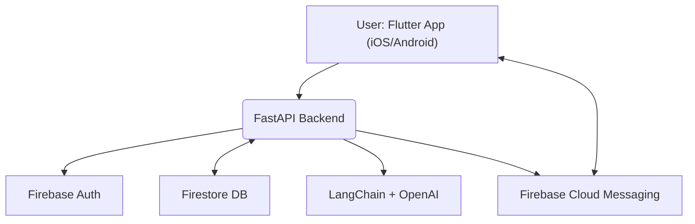
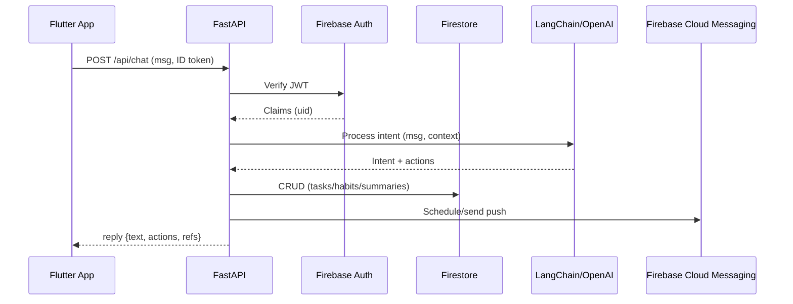
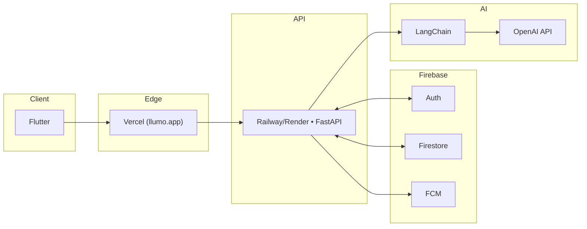

# AI Personal Companion — System Architecture

> **Phase:** DEFINE
> 
> **Task:** System Architecture Mapping
> 
> **Owner:** @bySharkster
> 
> **Status:** In Progress
> 
> **Last updated:** 2025-10-05

---

## 1, High‑Level Overview

The system integrates a Flutter client, a FastAPI backend, Firebase services (Auth, Firestore, FCM), and an AI layer using LangChain + OpenAI to deliver chat-driven task management, habit learning, and daily summaries.



---

## 2. Core Components

| Layer         | Technology                         | Purpose                                          |
| ------------- | ---------------------------------- | ------------------------------------------------ |
| **Frontend**  | Flutter (Dart)                     | Chat UI, task/reminder UI, onboarding            |
| **Backend**   | FastAPI (Python)                   | API gateway, auth verification, AI orchestration |
| **DB**        | Firebase Firestore                 | Users, tasks, habits, summaries                  |
| **AI**        | LangChain + OpenAI API             | Intent detection, routine learning, summaries    |
| **Auth**      | Firebase Auth (OIDC)               | Identity & JWT tokens                            |
| **Push**      | Firebase Cloud Messaging           | Notifications for reminders & daily plan         |
| **Hosting**   | Railway/Render (API), Vercel (web) | Deployment targets + TLS                         |
| **CI/CD**     | GitHub Actions                     | Build, test, deploy                              |
| **Analytics** | Firebase Analytics                 | Feature usage & retention metrics                |

---

## 3. Data Flow (request/response)

1. **User Message** → Flutter sends chat text to `POST /api/chat` with Firebase ID token.
2. **Auth Middleware** → FastAPI verifies JWT (Firebase) and extracts user ID.
3. **AI Orchestration** → LangChain parses intent; may call tools (CRUD on tasks, generate summary, etc.).
4. **Persistence** → Firestore stores/updates `tasks`, `habits`, `summaries`.
5. **Notify** → FCM sends immediate or scheduled notifications.
6. **Response** → FastAPI returns structured response (assistant message + actions taken).



---

## 4.API Surface (initial)

* `GET /api/health` → health probe (200 OK, version)
* `POST /api/chat` → chat + intent execution
* `POST /api/tasks` → create task/reminder
* `GET /api/tasks` → list tasks for user
* `PATCH /api/tasks/{id}` → update
* `DELETE /api/tasks/{id}` → delete
* `GET /api/summary/daily` → generate or fetch today’s plan

**Auth**: All endpoints (except `/health`) require Firebase ID token in `Authorization: Bearer <token>`.

---

## 5. Data Model (Firestore — draft)

```text
users/{uid}
  profile: { email, displayName, createdAt }
  settings: { timezone, notifEnabled, ... }

tasks/{taskId}
  ownerUid
  title
  dueAt (timestamp)
  priority (low|med|high)
  createdAt, updatedAt
  status (todo|done)

habits/{habitId}
  ownerUid
  name
  cadence (cron or structured)
  evidence: [{ ts, taskId }]

summaries/{summaryId}
  ownerUid
  date (YYYY-MM-DD)
  text
  items: [{ taskId, rank }]
```

**Security Rules (concept):** Only `ownerUid` can read/write their docs; server verifies UID from token. Server-side admin SDK used for scheduled jobs if needed.

---

## 6. Security & Privacy

* **AuthN**: Firebase Auth JWT verification middleware in FastAPI.
* **AuthZ**: Per-user document ownership enforced by Firestore rules.
* **Secrets**: Stored in GitHub/Platform env (OpenAI key, Firebase admin JSON, etc.).
* **CORS**: Allow `https://llumo.app`, `https://www.llumo.app`, and preview domains.
* **PII**: Minimal storage; no model training on user data; log redaction for prompts.

---

## 7. Notifications

* **Immediate**: On task creation with near-term due time.
* **Scheduled**: Daily summary at user’s local morning hour.
* **Channel**: FCM tokens stored per device; FastAPI triggers or Cloud Functions cron.

---

## 8. Deployment Topology



---

## 9. Observability

* **Logging**: Structured JSON logs from FastAPI; request IDs.
* **Metrics**: Firebase Analytics, custom counters for intents executed, errors, latency.
* **Tracing**: Optional OpenTelemetry exporter.

---

## 10. Risks & Mitigations (architecture)

| Risk                | Impact | Mitigation                                    |
| ------------------- | ------ | --------------------------------------------- |
| Token/latency costs | $$     | Caching, smaller models, rate limits          |
| Push reliability    | Medium | Retry/backoff + delivery receipts             |
| Data consistency    | Medium | Idempotent writes, server timestamps          |
| Secret sprawl       | High   | Centralize env management; short‑lived tokens |

---

## Acceptance Criteria

* `docs/architecture.md` merged in repo
* Mermaid diagrams render on GitHub
* Project item updated to **To Define --> Complete** after review
